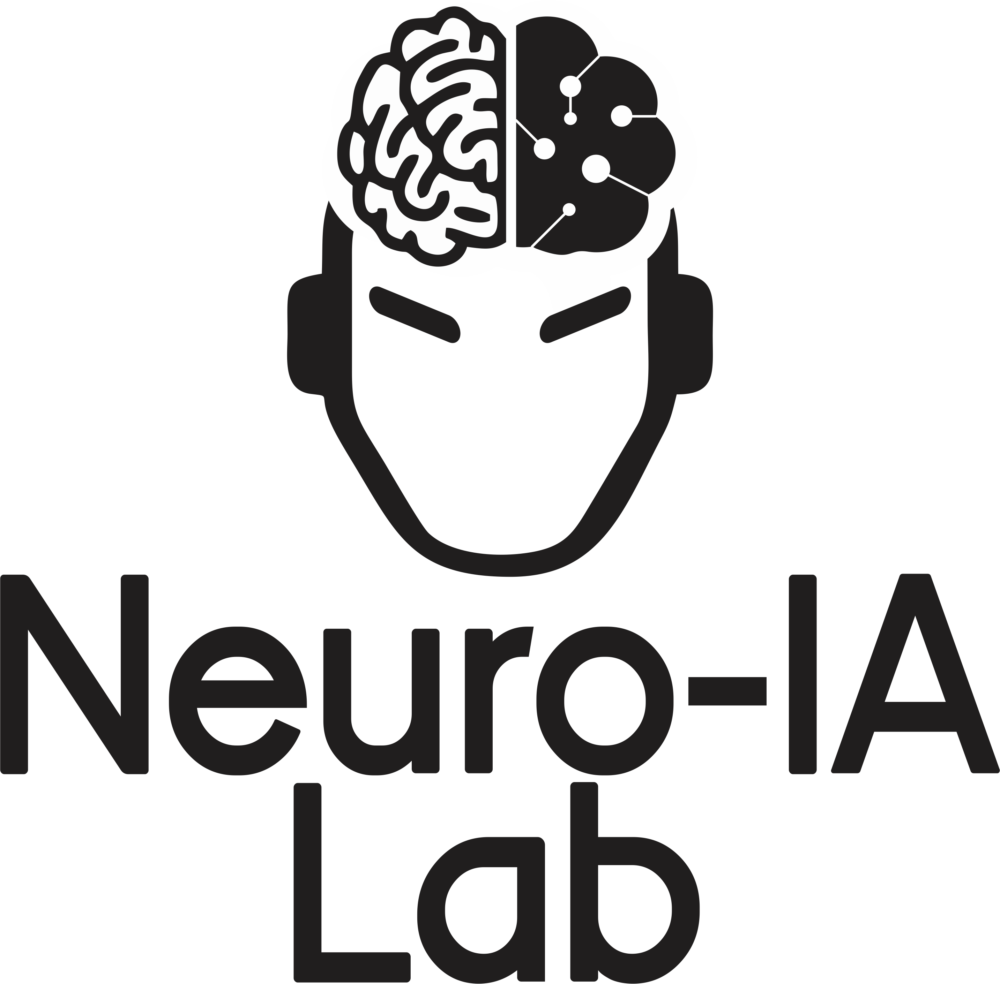

# pyhiamp

**PyHIamp** (PHA) es una librería para recibir y almacenar datos (EEG, EMG, ECG y EOG) provenientes del amplifcador [g.HIamp](https://www.gtec.at/product/g-hiamp-256-channel-biosignal-amplifier/?srsltid=AfmBOopsnqXDTC9HQtDxvuPybDzjuMH8TxZDeXKLqy3aMGgrcF2gX5dc) entre otras características (ver sección [Características](#características)).

PHA utiliza [Lab Streaming Layer](https://github.com/sccn/labstreaminglayer/?tab=readme-ov-file) (LSL) como interfaz entre g.HIamp y Python a través de [PyLSL](https://github.com/labstreaminglayer/pylsl) . LSL es un sistema para la transmisión de datos de tiempo real entre aplicaciones en la misma máquina o en la red.

PyHIamp es un desarrollo del **Laboratorio de Neruociencias e Inteligencia Artificial Aplicada** (Neuro-IA Lab) de la *Universidad Tecnológica del Uruguay*.

### Autor

- [Lucas Baldezzari](https://www.linkedin.com/in/lucasbaldezzari/)

# Funcionamiento geneal

El emplificador g.HIAMP envía los datos de la señal de EEG y los eventos registrados por el trigbox a través de g.NEEDAccess. Utilizando el protocolo LSL, los datos son transmitidos a través de la red local con una IP y puerto específicos. Por otro lado, usando PyLSL se generan eventos y marcadores importantes de la sesión expermiental. Además, se pueden recibir datos para graficarlos en tiempo real.

Los datos provenientes del amplificador, como los eventos y marcadores generados con PyLSL se guardan en un archivo XDF a través de [LabRecorder](https://github.com/labstreaminglayer/App-LabRecorder)

# Características

- [x] Recibir datos de señal y eventos provenientes de g.HIamp y almacenarlos en un archivo XDF usando LabRecorder.
- [x] Generar eventos enviarlos a través de LSL.
- [x] Almacenar los datos en un archivo XDF usando [XDF](https://github.com/sccn/xdf).

# Dependencias

- g.NeedAccess (g.HIamp)
- [Lab Streaming Layer](https://github.com/labstreaminglayer) (LSL). Docs [here](https://labstreaminglayer.readthedocs.io/).
- [App-Input](https://github.com/labstreaminglayer/App-Input)
- PyLSL
- Python 3.10+
- NumPy
- SciPy
- Matplotlib
- Pandas
- PyQt5

# Instaladores y ropositorios de paquetes

- [liblsl][https://github.com/sccn/liblsl/releases]

# Instalación

# Ejemplos de uso

# Documentación

# Referencias

- [Lab Streaming Layers for Brain Data with Python](https://www.youtube.com/watch?v=oLulfdNI3E0&ab_channel=EsbenKran)
- [Demo 1 The Lab Streaming Layer](https://www.youtube.com/watch?v=Y1at7yrcFW0&ab_channel=TheQualcommInstitute)

## Licencia